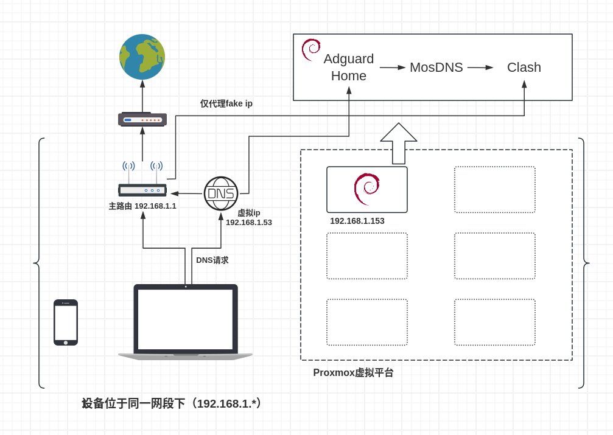
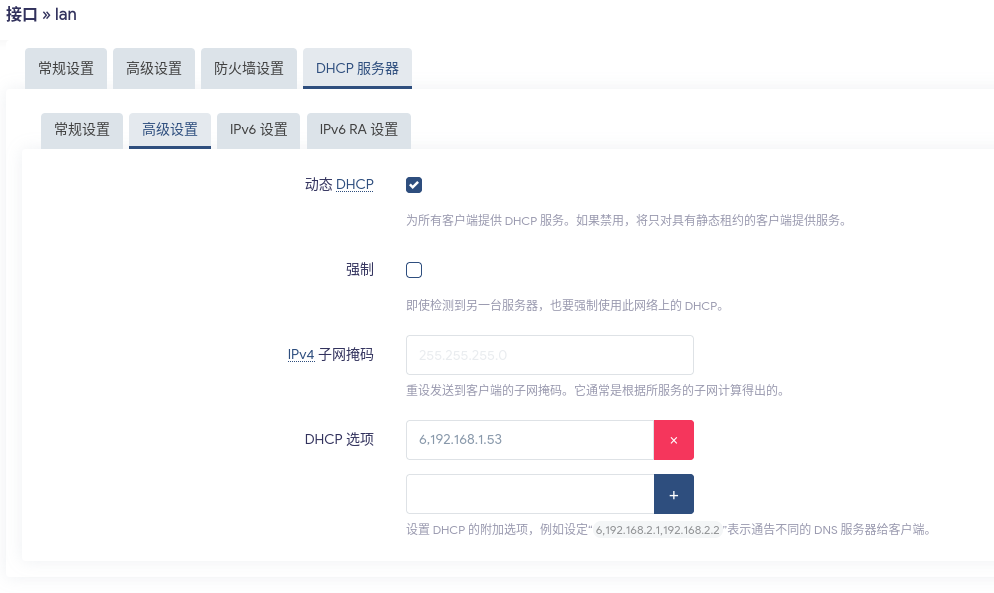
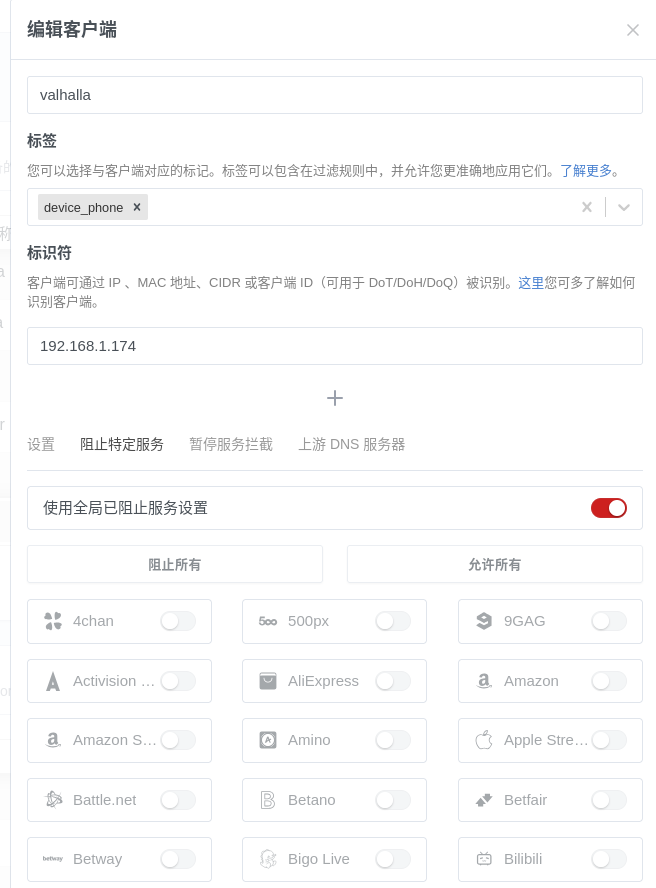

+++
date = '2025-11-15T20:22:24+08:00'
draft = false
title = '家庭网络折腾记录（零）：整体设计思路'
description = "家庭网络<OpenWRT主路由+Debian DNS服务（含去广告、分流）+Fake IP代理>方案的整体设计思路和方案对比"
categories = [
    "Homelab折腾记录"
]
tags = [
    "Homelab",
    "Linux",
    "OpenWrt",
    "Debian",
    "DNS"
]
image = "twilightgirl.jpg"
+++

Homelabbing is just a kind of roleplaying, roleplaying as sysadmins.


## 前言
去年给家里的Redmi AX6S刷了OpenWrt，相比原厂系统灵活了很多，并且装上了OpenClash，用默认配置就能给连上网络的所有设备提供透明的魔法上网体验，稳定使用一年多，因此在此期间搞了一堆二手零件，凑了一台电脑装上Proxmox虚拟机平台作为Homelab。

最近又想着在在路由器上装一些别的插件，这样一来仅仅256MB的内存就不太够用了，遂着手研究所谓的"旁路由"（？）方案，一开始是在Proxmox上创建了一个虚拟机安装OpenWrt（实际上是ImmortalWrt），在主路由给客户端设置网关和DNS为旁路由ip（最简单的方案），然后参考[这位博主](https://songchenwen.com/tproxy-split-by-dns)的方案，装上了Adguard Home等服务，并作了fake ip段`198.18.0.0/16`的分离和策略路由（这位博主没有使用旁路由，这个思路实际上来自他的评论区）

然而这样一折腾，想要而效果似乎是基本上达到了，但OpenClash默认配置的nftables较复杂，不便于自定义，有时出了点问题都不知道怎么排查错误，OpenWrt作为精简系统也有诸多残缺的地方，所以我参考[这位博主](https://evine.win/p/%E6%88%91%E7%9A%84%E5%AE%B6%E5%BA%AD%E7%BD%91%E7%BB%9C%E8%AE%BE%E8%AE%A1%E6%80%9D%E8%B7%AF%E5%BC%80%E5%90%AFdebian%E7%9A%84%E6%97%81%E8%B7%AF%E7%94%B1%E4%B9%8B%E8%B7%AF%E4%B8%80)（实际上这个系列的底子都是来自他的方案）并结合前人可能的优势和我实际情况，形成了本文中讨论的这一方案。

## （可能是）最终方案

### 各模块简介
**主路由**：ImmortalWrt 24.10 `192.168.1.1`

（是否使用Immortal实际上并不重要，我纯粹是为了方便，版本只要是用`Firewalld4`和`nftables`的就行，本文默认使用`nft`命令）在dhcp选项中设置`6,192.168.1.53`,给dhcp客户端下发DNS为`192.168.1.53`，主路由还有一项重要任务就是将Clash产生的Fake IP的网段的流量转发给代理机

> ！在全部搭建好之前，你当然**不应该**这样设置 ！

**DNS虚拟ip** `192.168.1.53` ==> `192.168.1.1` 或 `192.168.1.153`

这是由于我的现实情况可能出现homelab下线，如果使用dhcp选项直接下发`192.168.1.153`为唯一DNS，那么当homelab下线时，dhcp客户端仍然向已经不存在的`.153`发出DNS请求，就会导致网络瘫痪，实际上dhcp选项可以下发多个DNS服务器，但在切换时客户端可能有一定的延迟（我没有自己测试过），我希望尽量无缝切换的体验

**DNS+代理机** Debian 13 `192.168.1.153`

安装Adguard Home提供广告过滤，MosDNS国内外分流，Clash负责国外DNS产生Fake IP，国内DNS传回主路由进行处理，Fake IP流量在经过主路由时被转发到该机器的Clash进行代理，其他流量不受影响

## 参考方案对比
### DNS服务的序列
实际上，我最初尝试这三个服务的结合时，第一个成功的方案是把OpenClash前置，例如参考[这个网页](https://github.com/Kirbytronic/openclash-mosdns-adguardhome)上面的方案，他的方案成功后，在Adguard Home的管理界面里只能看到一个客户端`127.0.0.1`，这就使得AdgHome的功能残缺了，所以我后面都探索AdgHome前置的方案。

### 单一路由的方案
当前的DNS顺序，我最初参考了[这位博主](https://songchenwen.com/tproxy-split-by-dns)和[这位博主](https://blog.openwrtcn.eu.org/dnsling-wu-ran/)的文章，两者方案类似，都没有采用旁路由，后者使用`iptables`，对于现在的OpenWrt版本来说已经有些过时了，这一方案对我来说难以实现，我的主路由性能不足以承载这些服务，所以我照搬了这一方案，并把网关和DNS都设置到proxmox上的那台ImmortalWrt，基本功能确实实现了，但我所希望的"只有国外流量经过clash内核"不知怎么还是没有实现，于是开始寻求国内流量直接不经过旁路由的方法，前者的网站有评论区，我在评论区中学习到了该方案在旁路由下可能的配置方式。(在这之前我对**路由表**和**路由规则**几乎没有了解

### 不同的旁路由代理方案
|   | Fake IP    | 真实IP   |
| --------  | -------- | ------ |
| 只下发DNS | 主路由通过路由规则仅转发fake ip段到clash | 需要在主路由上作分流，压力大 |
| 下发DNS和网关 | 在旁路由上通过nft转发fake ip段，但所有流量都经过了旁路由 | 在旁路由上作分流，所有流量都经过 |

按我理解，只下发DNS，可以做到几乎不影响正常国内上网，但Fake IP模式下主路由上的分流相较于真实IP是更加简单的，而下发DNS和网关时这两种模式的差异实际上和单一路由下的情况差不多（？）

## 总结
### 一种另类的"旁路由"（？）
旁路由的概念一直很模糊，我自己也一知半解，个人理解为客户端使用主路由之外的一台机器作为网关（无论是通过手动设置还是dhcp选项自动下发），大多数时候也同时提供DNS服务，这是目前网上最常见的方案，但这种方案有一个问题，所有流量，无论是否需要代理，都经过"旁路由"，也许当中的开销不大，但我认为这是不必要的，我希望能够避免。另外，所有流量经过mosdns的域名分流后，最终还要再进行一次分流（通过clash核心或nftables），这可能是不必要的。

所以我选择所谓的旁路由只负责DNS和国外流量的代理，其他流量正常走主路由，就像没有旁路由一样（）（理论上是这样），实现方法就是在主路由的dhcp选项中只下发DNS，网关仍使用主路由，通过在主路由上设置路由规则把需要代理的流量转发到clash。（在各大网络论坛中提到这种方案的人有很多，但似乎详细写这个的博主少（？））

如果要采用这个方案，我们就需要采用clash的fake ip模式，它在这里的意义在于把所有国外ip映射到一个网段`198.18.0.0/16`下，方便在主路由上设置路由规则进行转发，否则的话，clash解析出来真实ip，在经过主路由时还要进行分流，不仅多余而且对于主路由性能不佳的情况，容易造成负担，不如直接把网关也设置到旁路由，在性能更强的旁路由上作分流，本系列大量参考的[这位博主](https://evine.win/p/%E6%88%91%E7%9A%84%E5%AE%B6%E5%BA%AD%E7%BD%91%E7%BB%9C%E8%AE%BE%E8%AE%A1%E6%80%9D%E8%B7%AF%E5%BC%80%E5%90%AFdebian%E7%9A%84%E6%97%81%E8%B7%AF%E7%94%B1%E4%B9%8B%E8%B7%AF%E4%B8%80)就是用的真实IP的不分离方案。

### 服务顺序的优势
`Adguard Home => MosDNS => Clash`的顺序，Adguard Home的功能是最丰富的，也是配置较为不灵活的，按我个人理解Adguard Home必须在最前，才能保留其所有功能（例如如果把Adguard Home放在其他服务后面，无法正确识别客户端，而我希望用到Adguard Home的客户端管理功能），MosDNS放中间，它有灵活的转发和切换功能，即使后面的Clash炸了，也可以设置fallback防止影响基本上网功能（我自己暂时还没有这样做，我可能宁愿直接把旁路由关了（））

### DNS高可用
前面已经说过，这是由于我的实际情况，`.153`很可能不会一直在线，所以选择了采用单个虚拟ip的模式，用`keepalived`实现，后续会补充相应脚本，用于在主备节点切换时修改nftables和路由规则。

### 关于ipv6
呃呃不太懂，暂时不弄（）

## 后续
后续我将逐一记录下我按照该方案安装和配置系统，安装相关服务，配置自动脚本等具体过程以及我在其中踩到的一些（很多...）坑
